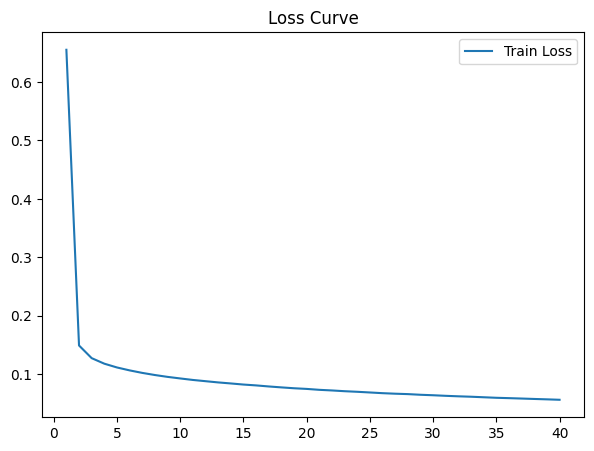

Based on your code, the paper, and your usage of both the model architecture diagram from the paper and `torchviz` for your own model visualization, here's a more **academic and polished** version of your `README.md` file:

---

## 🧠 Introduction

Recent advances in deep learning have enabled transformative approaches in computational fluid dynamics (CFD), particularly in accelerating simulations and improving resolution through data-driven surrogates. One such approach, known as **super-resolution**, has shown significant promise in reconstructing high-fidelity flow fields from coarse CFD data. Originally developed for image enhancement in computer vision, super-resolution techniques are now being applied to engineering domains where computational cost and spatial resolution are critical limitations.

This repository implements a **deep convolutional neural network** based on the **U-Net architecture with residual blocks**, inspired by the methodology introduced in the paper:

> Hu, B. et al., *Super-resolution-assisted rapid high-fidelity CFD modeling of data centers*, Building and Environment, 2024. [DOI: 10.1016/j.buildenv.2023.111036](https://doi.org/10.1016/j.buildenv.2023.111036)

While the original work focused on thermal modeling of airflow in data centers, this project adapts the proposed framework to a different problem: the **super-resolution of 2D turbulent velocity fields**. The goal is to reconstruct high-resolution representations of turbulent flow from low-resolution inputs, thereby enabling faster simulations without compromising physical accuracy.

We use publicly available datasets of 2D incompressible turbulent flow fields. The high-resolution data (`kf_2d_re1000_256_40seed.npy`) represent the ground truth, while the low-resolution data (`kmflow_sampled_data_irregnew.npz`) simulate coarse measurements or reduced CFD fidelity. A normalization pipeline ensures proper conditioning of the network inputs.
<p align="center">
  
</p>
The proposed model follows a typical encoder–decoder structure. The **encoder (downsampling)** path uses residual blocks and max pooling to extract multi-scale spatial features. The **decoder (upsampling)** path employs transposed convolutions and skip connections to reconstruct detailed high-resolution outputs. A residual bottleneck block is introduced at the center of the network to enhance representational capacity. The architecture is trained using Mean Squared Error (MSE) loss, with optional learning rate scheduling and gradient clipping for stability.

This implementation not only tests the scalability of super-resolution techniques beyond their original domain but also demonstrates their utility in enhancing turbulence modeling, a longstanding challenge in fluid mechanics. By learning a mapping from low- to high-resolution representations, the model provides a promising alternative to expensive fine-grid CFD simulations, with potential implications for reduced-order modeling and real-time flow field prediction.

---

## 📌 Key Contributions

- Implementation of a deep CNN for super-resolution of 2D turbulent fluid flow fields.
- Adaptation of the concept from data center cooling to a general-purpose turbulence dataset.
- Visualization and evaluation of predicted vs. ground truth fields.
- Use of `torchviz` for model structure visualization.
- Use of normalized preprocessing, residual connections, and skip connections in a U-Net architecture.

---

## 🧠 Inspiration

The methodology is based on this figure from the original paper:

<p align="center">
  
</p>

Our network aims to perform a similar super-resolution task, adapted for 2D incompressible turbulence flows.

---

## 🗂 Dataset

We used:
- Low-resolution irregular CFD data: [`kmflow_sampled_data_irregnew.npz`](https://figshare.com/ndownloader/files/39214622)
- High-resolution field data: [`kf_2d_re1000_256_40seed.npy`](https://figshare.com/ndownloader/files/39181919)

These datasets contain velocity field slices of 2D turbulent flow simulations.

---

## 🧱 Network Architecture

The network consists of:
- Initial convolution layer
- **Downsampling path**: residual blocks with max pooling
- **Bottleneck**: deep residual learning
- **Upsampling path**: transposed convolutions + skip connections
- Final output convolution

<p align="center">
  
</p>

_Model architecture rendered with `torchviz`._

---

## 🔧 Training Setup

- Loss: `MSELoss` (optionally `L1Loss`)
- Optimizer: `Adam` with learning rate decay using `ReduceLROnPlateau`
- Framework: PyTorch
- Hardware: GPU or CPU-compatible

```python
optimizer = optim.Adam(model.parameters(), lr=1e-5)
scheduler = optim.lr_scheduler.ReduceLROnPlateau(optimizer, 'min')
criterion = nn.MSELoss()
```

Training for 40 epochs (20+20) with gradient clipping and adaptive learning rate scheduling.

---

## 📊 Example Outputs

Here is a comparison between:
- **LR input** (coarse CFD result)
- **SR output** (predicted high-resolution)
- **Ground truth** (actual CFD result)

<p align="center">
  
</p>

The model successfully reconstructs fine-scale features missing from the low-resolution input.

---

## 📈 Loss Curve

<p align="center">
  
</p>

---

## 🧾 Citation

If you use this repository, please cite the original paper:

```
@article{hu2024superresolution,
  title={Super-resolution-assisted rapid high-fidelity CFD modeling of data centers},
  author={Hu, Beichao and Yin, Zeda and Hamrani, Abderrachid and Leon, Arturo and McDaniel, Dwayne},
  journal={Building and Environment},
  volume={247},
  pages={111036},
  year={2024},
  publisher={Elsevier},
  doi={10.1016/j.buildenv.2023.111036}
}
```

---

## ⚠️ Licensing

The diagrams from the paper are used under **fair use** for educational and academic purposes. The main figure has been **recreated or included with proper citation**. Please do not reuse these figures commercially.


## 📬 Contact

For questions or collaborations, feel free to reach out.
ali0aliakbari0@gmail.com
---
